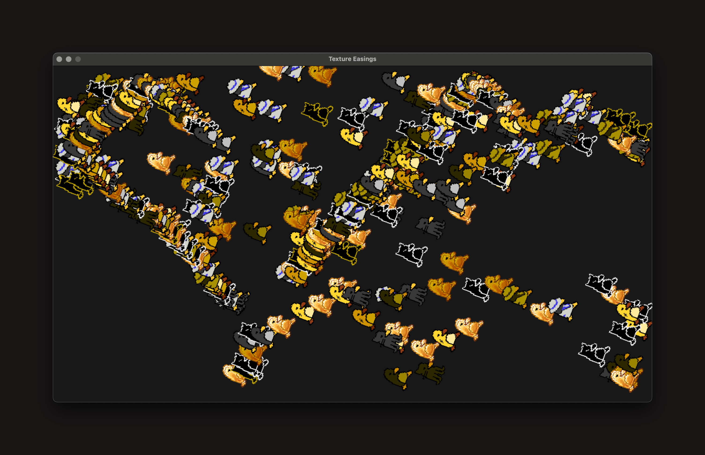

<div class="center">
    <h1>Texture Easings</h1>
    
    <p>A simple example of animating textures with easing functions done in C and SDL3</p> Images were created by the awesome Tsoding Community and can be found <a href="https://penger.city/" target="_blank">here</a>.
</div>

## Prerequisites
Make sure you have the [SDL3](https://wiki.libsdl.org/SDL3/FrontPage) Library installed on your system.

### Building SDL3
Information about building SDL3 with `cmake` can be found [here](https://github.com/libsdl-org/SDL/blob/main/docs/README-cmake.md).

Here's what I did in order to build and install it on my system (MacOS):

```bash
# Clone the repo
git clone https://github.com/libsdl-org/SDL.git --depth=1 

# Navigate to cloned repo and prepare build folder
cd SDL
mkdir build
cd build

# Set CMake Configuration 
cmake .. -DCMAKE_BUILD_TYPE=Release

# Build SDL in release mode
cmake --build . --config Release --parallel

# Install SDL on your system
sudo make install
```

## Build and Run
In order to build and run simply execute the `Makefile`:

```bash
make
make run
```

## Acknowledgments
- [Easings](https://easings.net/)
- [Penger](https://penger.city/)
- [SDL3 Color Modes](https://examples.libsdl.org/SDL3/renderer/11-color-mods/)
